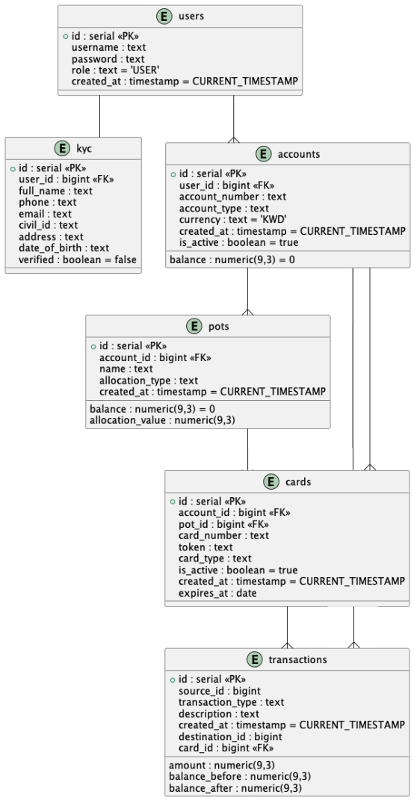

## Boki: Smart Budgeting System

> “where every fils knows where it goes.”

This is a multiservice backend system for managing users, bank accounts, and automated salary distribution into financial pots. It supports JWT-secured user and admin flows, tokenized cards, and salary-driven pot allocation logic.

---

### Architecture Overview

- **Microservices:**
  - `auth-service/` — handles user registration, login, and JWT issuance
  - `banking-service/` — manages accounts, pots, transactions, and admin actions
- Includes a `manual-schema.sql` to bootstrap the PostgreSQL database schema

---

### Entity Relationship Diagram

---

### API Documentation (Swagger)

- `auth-service` — http://localhost:2222/api-docs
- `banking-service` — http://localhost:4444/api-docs

---

### Core Features

- User registration and login
- Submit and update KYC information
- Admins can flag KYC submissions
- Create bank accounts (MAIN or SAVINGS)
- Create and edit financial pots (MAIN accounts only)
- Automated salary distribution into pots (percentage or fixed amount)
- View account summaries with pot breakdowns
- Transfer funds:
  - Pot → MAIN account
  - MAIN account → Pot
  - SAVINGS account → Pot
- Make purchases using physical or tokenized cards
- View transaction history
- Admins can close accounts

---

### API Endpoints

| Method | Path                                    | Description                       |
|--------|-----------------------------------------|-----------------------------------|
| POST   | `/api/v1/users/register`                | Register new user                 |
| POST   | `/api/v1/users/auth/login`              | Authenticate and issue token      |
| POST   | `/api/v1/kyc`                           | Submit KYC                        |
| POST   | `/api/v1/kyc/flag/{targetUserId}`       | Flag KYC (admin)                  |
| POST   | `/accounts/v1/create`                   | Create account (MAIN or SAVINGS)  |
| POST   | `/accounts/v1/{accountId}/pots`         | Create pot                        |
| POST   | `/accounts/v1/{accountId}/pots/{potId}` | Edit pot by ID                    |
| GET    | `/accounts/v1/{accountId}/summary`      | Get account summary               |
| POST   | `/admin/v1/accounts/{accountId}/close`  | Close account (admin)             |
| POST   | `/transactions/v1/salary`               | Deposit salary (admin)            |
| POST   | `/transactions/v1/pot/withdrawal`       | Withdraw to MAIN account          |
| POST   | `/transactions/v1/pot/deposit`          | Deposit from account to pot       |
| POST   | `/transactions/v1/purchase`             | Purchase using card               |
| POST   | `/transactions/v1/history`              | View transaction history          |

---

### Behavior-Driven Development (BDD) Tests

Tests are written in Cucumber-style `.feature` files that describe expected behavior in Gherkin (Given/When/Then format).

Locations:
- `auth-service/src/test/resources/features/`
- `banking-service/src/test/resources/features/`

> Coverage: 00%
